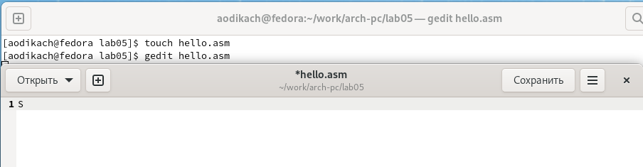
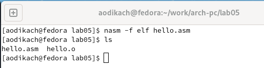
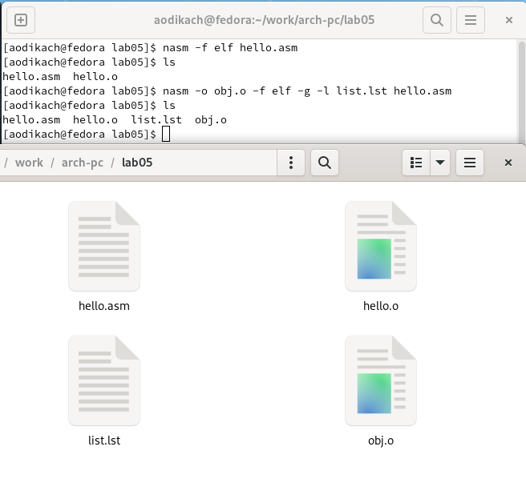
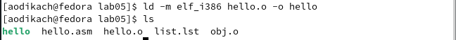
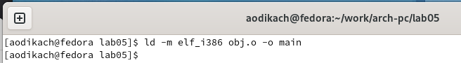
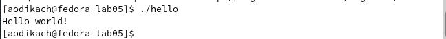

---
## Front matter
title: "Отчёт по лабораторной работе №5"
subtitle: "Дисциплина: Архитектура компьютера"
author: "Дикач Анна Олеговна"

## Bibliography
bibliography: bib/cite.bib
csl: pandoc/csl/gost-r-7-0-5-2008-numeric.csl

## Pdf output format
toc: true # Table of contents
toc-depth: 2
lof: true # List of figures
lot: true # List of tables
fontsize: 12pt
linestretch: 1.5
papersize: a4
documentclass: scrreprt
## I18n polyglossia
polyglossia-lang:
  name: russian
  options:
	- spelling=modern
	- babelshorthands=true
polyglossia-otherlangs:
  name: english
## I18n babel
babel-lang: russian
babel-otherlangs: english
## Fonts
mainfont: PT Serif
romanfont: PT Serif
sansfont: PT Sans
monofont: PT Mono
mainfontoptions: Ligatures=TeX
romanfontoptions: Ligatures=TeX
sansfontoptions: Ligatures=TeX,Scale=MatchLowercase
monofontoptions: Scale=MatchLowercase,Scale=0.9
## Biblatex
biblatex: true
biblio-style: "gost-numeric"
biblatexoptions:
  - parentracker=true
  - backend=biber
  - hyperref=auto
  - language=auto
  - autolang=other*
  - citestyle=gost-numeric
## Pandoc-crossref LaTeX customization
figureTitle: "Рис."
tableTitle: "Таблица"
listingTitle: "Листинг"
lofTitle: "Список иллюстраций"
lotTitle: "Список таблиц"
lolTitle: "Листинги"
## Misc options
indent: true
header-includes:
  - \usepackage{indentfirst}
  - \usepackage{float} # keep figures where there are in the text
  - \floatplacement{figure}{H} # keep figures where there are in the text
---

# Цель работы

Освоить процедуру компиляции и сборки программ, написанных на ассемблере NASM

# Выполнение лабораторной работы

1. Создаю каталог для работы с программами на языке ассемблера NASM и перехожу в созданный каталог (рис.1 [-@pic1])

{ #pic1 width=70% }
2. Создаю текстовый файл с именем hello.asm и открываю этот файл с помощь любого текстового редактора. Ввожу текст (рис.2 [-@pic2])

{ #pic2 width=70% }
3. Для компиляции приведённого выше текста пишу следующую команду. Проверяю  что объектный файл создан(рис.3 [-@pic3])

{ #pic3 width=70% }

4. Выполняю следующую команду и проверяю был ли созданы файлы (рис.4 [-@pic4])

{ #pic4 width=70% }
5. Передаю файл  в работу компоновщику и проверяю был ли создан исполняемый файл (рис.5 [-@pic5])

{ #pic5 width=70% }
6. Выполняю следующую команду (рис.6 [-@pic6]). Полученный исполняемый файл имеет название main, а исходный объектный obj.o

{ #pic6 width=70% }
6. Запускаю на выполнение созданный исполняемый файл (рис.7 [-@pic7])

{ #pic7 width=70% }

# Задание для самостоятельной работы

1.  В каталоге ~/work/arch-pc/lab05 с помощью команды cp создаю копию
файла hello.asm с именем lab5.asm (рис.8 [-@pic8])

{ #pic8 width=70% }
2. Вношу изменения в текст программы (рис.9 [-@pic9])

{ #pic9 width=70% }
**текст программы:** ; hello.asm
SECTION .data ; Начало секции данных
    hello: DB 'Dikach Anna',10 ;  'Dikach Anna' плюс
    ;символ перевода строки
    helloLen: EQU $-hello ; Длина строки hello

SECTION .text ; Начало секции кода
    GLOBAL _start

_start: ; Точка входа в программу
    mov eax,4 ; Сиситемный вывод для записи
    mov ebx,1 ; Описатель файла 'l' - стандартный вывод
    mov ecx,hello ; Адрес строки hello в ecx
    mov edx,helloLen ;  Размер строки hello
    int 80h ; Вызов ядра
    
    mov eax,1 ; Системный вызов для входа
    mov ebx,0 ; Выход с кодом возврата '0' (без ошибок)
    int 80h ; Вызов ядра
3. Транслирую полученный текст программы lab5.asm в объектный
файл. Выполняю компоновку объектного файла и запускаю получившийся исполняемый файл (рис.10 [-@pic10])

{ #pic10 width=70% }
4. Копирую файлы hello.asm и lab5.asm в мой локальный репозиторий
в каталог ~/work/study/2022-2023/"Архитектура компьютера"/arch-
pc/labs/lab05/. Загружаю файлы на Github. (рис.11 [-@pic11])

{ #pic11 width=70% }

# Выводы

Освоила процедуры компиляции и сборки программ, научилась пользоваться транслятором, расширенным синтаксисом командной строки, компоновщиком, запускать исполняемый файл.

