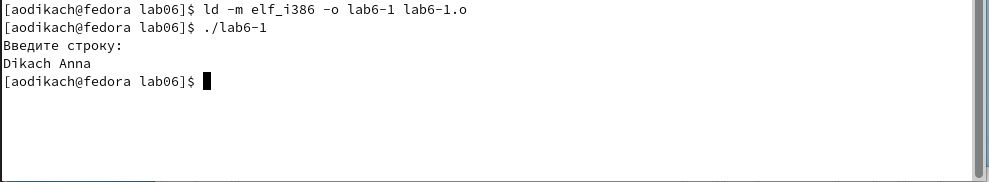
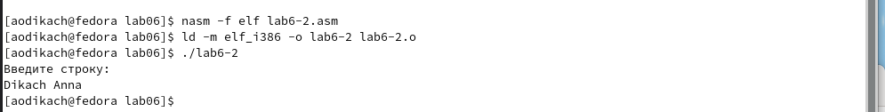

---
## Front matter
title: "Отчёта по лабораторной работе"
subtitle: "Лабораторная №6"
author: "Дикач Анна Олеговна"

## Generic otions
lang: ru-RU
toc-title: "Содержание"

## Bibliography
bibliography: bib/cite.bib
csl: pandoc/csl/gost-r-7-0-5-2008-numeric.csl

## Pdf output format
toc: true # Table of contents
toc-depth: 2
lof: true # List of figures
lot: true # List of tables
fontsize: 12pt
linestretch: 1.5
papersize: a4
documentclass: scrreprt
## I18n polyglossia
polyglossia-lang:
  name: russian
  options:
	- spelling=modern
	- babelshorthands=true
polyglossia-otherlangs:
  name: english
## I18n babel
babel-lang: russian
babel-otherlangs: english
## Fonts
mainfont: PT Serif
romanfont: PT Serif
sansfont: PT Sans
monofont: PT Mono
mainfontoptions: Ligatures=TeX
romanfontoptions: Ligatures=TeX
sansfontoptions: Ligatures=TeX,Scale=MatchLowercase
monofontoptions: Scale=MatchLowercase,Scale=0.9
## Biblatex
biblatex: true
biblio-style: "gost-numeric"
biblatexoptions:
  - parentracker=true
  - backend=biber
  - hyperref=auto
  - language=auto
  - autolang=other*
  - citestyle=gost-numeric
## Pandoc-crossref LaTeX customization
figureTitle: "Рис."
tableTitle: "Таблица"
listingTitle: "Листинг"
lofTitle: "Список иллюстраций"
lotTitle: "Список таблиц"
lolTitle: "Листинги"
## Misc options
indent: true
header-includes:
  - \usepackage{indentfirst}
  - \usepackage{float} # keep figures where there are in the text
  - \floatplacement{figure}{H} # keep figures where there are in the text
---

# Цель работы
Приобретение практических навыков работы в Midnight Commander. Освоение инструкций языка ассемблера mov и int.

# Выполнение лабораторной работы

1. Открываю Midnight Commander  (рис.1 [-@fig:001])

![Рис.1:Midnight Commander] (image/pic1.png){ #fig:001 width=70% }

2. Перехожу в каталог ~/work/arch-pc созданный при выполнении лабораторной работы

3. Создаю папку lab06 и перехожу в созданный каталог (рис.2 [-@fig:002])

![Рис.2:Создание каталога ] (image/pic2.png){ #fig:002 width=70% }

4. Пользуюсь строкой ввода и командой touch создаю файл lab6-1.asm (рис.3 [-@fig:003])

![Рис.3:Создание файла] (image/pic3.png){ #fig:003 width=70% }

5. Открываю файл lab6-1.asm для редактирования во встроенном редакторе

6. Ввожу текст программы из листинга 6.1, сохраняю изменения и закрываю файлы (рис.4 [-@fig:004])

![Рис.4:Текст листингa] (image/pic4.png){ #fig:004 width=70% }

## Программа вывода сообщения на экран и ввода строки с клавиатуры
7. Открываю файл для просмотра, убеждаюсь в наличии текста программы (рис.5 [-@fig:005])

![Рис.5:Просмотр файла] (image/pic5.png){ #fig:005 width=70% }

8. Транслирую текст программ lab6-1.asm в объектный файл. Выполняю компоновку объектного файла и запускаю получившийся исполняемый файл. (рис.6 [-@fig:006])

{ #fig:006 width=70% }

## Подключение внешнего файла in_out.asm
9. Скачиваю файл in_out.asm со страницы курса в ТУИС

10. Подключаемый файл in_out.asm должен лежать в том же каталоге, что и файл с программой, в которой он используется (рис.7 [-@fig:007])

![Рис.7:Копирование файла] (image/pic7.png){ #fig:007 width=70% }

11. Создаю копию файла lab6-1.asm с именем lab6-2.asm (рис.8 [-@fig:008])

{ #fig:008 width=70% }

12. Исправляю текст программы в файле lab6-2.asm с использование подпрограмм из внешнего файла in_out.asm в соответствии с листингом 6.2. Создаю исполняемый файл и проверяю его работу (рис.9 [-@fig:009])

![Рис.9:Исправленный текст] (image/pic9.png){ #fig:009 width=70% }

## Программа вывода сообщения на экран и ввода строки с клавиатуры с использованием файла in_out.asm

13. В файле lab6-2.asm заменяю подпрограмму sprintLF на sprint. Создаю исполняемый файл и проверяю его работу. Файл lab6-2 до изменений перерводил нас на следующую строку после сообщения "Введите строку:", файл lab6-2 после изменений не перекидывает нас на следующую строку после фразы "Введите строку:" => LF переносит ответ на строку на следующую строку (рис.10 [-@fig:010]) и (рис.11 [-@fig:011])

{ #fig:010 width=70% }
{ #fig:011 width=70% }
# Задание для самостоятельной работы 

1. Создаю копию файла lab6-1.asm (lab6-3.asm). Вношу изменения в программу файла lab6-3.asm (рис.12 [-@fig:012])

{ #fig:012 width=70% }

2. Получаю исполняемый файл и проверяю его работу (рис.13 [-@fig:013])

{ #fig:013 width=70% }

3. Создаю копию файла lab6-2.asm (lab6-4.asm). Исправляю текст программы с использованием подпрограмм из внешнего файла n_out.asm (рис.14 [-@fig:014])

![Рис.14:Изменённая программа] (image/pic14.png){ #fig:014 width=70% }
4. Создаю исполняемый файл и проверяю его работу (рис.15 [-@fig:015])

{ #fig:015 width=70% }

# Выводы
Приобрела практические навыки работы с Midnight Commander. Научилась писать программу вывода сообщения на экран и ввода строки с клавиатуры, подключать внешний файл, писать программу вывода сообщений на экран и ввода строки с клавиатуры. 

