---
## Front matter
title: "Отчёт по лабораторной работе"
subtitle: "Лабораторная №7"
author: "Дикач Анна Олеговна"

## Generic otions
lang: ru-RU
toc-title: "Содержание"

## Bibliography
bibliography: bib/cite.bib
csl: pandoc/csl/gost-r-7-0-5-2008-numeric.csl

## Pdf output format
toc: true # Table of contents
toc-depth: 2
lof: true # List of figures
lot: true # List of tables
fontsize: 12pt
linestretch: 1.5
papersize: a4
documentclass: scrreprt
## I18n polyglossia
polyglossia-lang:
  name: russian
  options:
	- spelling=modern
	- babelshorthands=true
polyglossia-otherlangs:
  name: english
## I18n babel
babel-lang: russian
babel-otherlangs: english
## Fonts
mainfont: PT Serif
romanfont: PT Serif
sansfont: PT Sans
monofont: PT Mono
mainfontoptions: Ligatures=TeX
romanfontoptions: Ligatures=TeX
sansfontoptions: Ligatures=TeX,Scale=MatchLowercase
monofontoptions: Scale=MatchLowercase,Scale=0.9
## Biblatex
biblatex: true
biblio-style: "gost-numeric"
biblatexoptions:
  - parentracker=true
  - backend=biber
  - hyperref=auto
  - language=auto
  - autolang=other*
  - citestyle=gost-numeric
## Pandoc-crossref LaTeX customization
figureTitle: "Рис."
tableTitle: "Таблица"
listingTitle: "Листинг"
lofTitle: "Список иллюстраций"
lotTitle: "Список таблиц"
lolTitle: "Листинги"
## Misc options
indent: true
header-includes:
  - \usepackage{indentfirst}
  - \usepackage{float} # keep figures where there are in the text
  - \floatplacement{figure}{H} # keep figures where there are in the text
---

# Цель работы

Освоение арифметических инструкций языка ассемблера NASM.

 
# Выполнение лабораторной работы
## Символьные и численные данные NASM

1. создаю каталог для программ лабораторной работы №7, перехожу в него и создаю файл lab7-1.asm (рис. [-@fig:001])

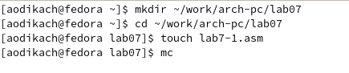{ #fig:001 width=70% }

2. копирую текст программы в созданный файл, также помещаю в директорию файл in_out.asm; создаю исполняемый файл и запускаю его (рис. [-@fig:002])

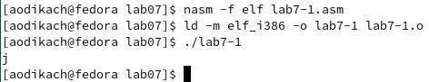{ #fig:002 width=70% }

3. меняю текст программы, создаю исполняемый файл, запускаю его. cимвол на экране по таблице ASCII соответствует символу ◙ (рис. [-@fig:003])(рис. [-@fig:004])

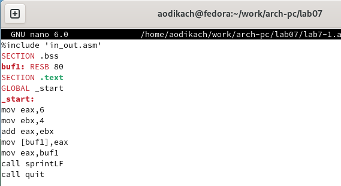{ #fig:003 width=70% }
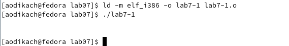{ #fig:004 width=70% }

4. создаю файл lab7-2.asm и ввожу в него текст программы. создаю исполняемый файл и запускаю его (рис. [-@fig:005])(рис. [-@fig:006])

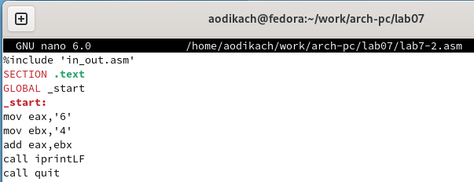{ #fig:005 width=70% }
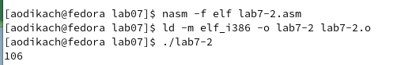{ #fig:006 width=70% }

5. меняю текст программы, создаю исполняемый файл, запускаю его. после запуска файла получаем результат равный 10, после замены iprintLF на iprint функция не переносит ответ "10" на отдельную строку  (рис. [-@fig:007])(рис. [-@fig:008])

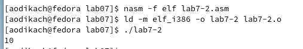{ #fig:007 width=70% }
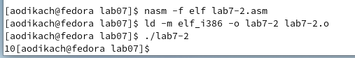{ #fig:008 width=70% }

## Выполнение арифметических операций NASM

6. создаю файл lab7-3.asm, ввожу в него текст программы. создаю исполняемый файл, запускаю его (рис. [-@fig:009])

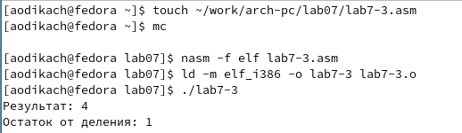{ #fig:009 width=70% }

7. изменяю текст программы так, чтобы вычислялась функция 𝑓(𝑥) = (4 ∗ 6 + 2)/5. создаю исполняемый файл, запускаю его (рис. [-@fig:010])

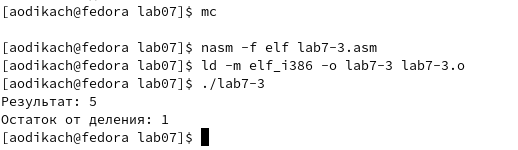{ #fig:010 width=70% }

8. создаю файл variant1.asm и копирую в него текст программы. создаю исполняемый файл, запускаю его, проверяю полученный результат (рис. [-@fig:011])

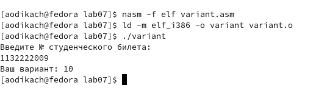{ #fig:011 width=70% }

## Ответы на вопросы 
1. Какие строки листинга 7.4 отвечают за вывод на экран сообщения ‘Ваш
вариант:’?
mov eax,rem
call sprint

2. Для чего используется следующие инструкции? nasm mov ecx, x
mov edx, 80 call sread
Благодаря этим строчкам в переменную считывается и записывается значение студенческого билета

3. Для чего используется инструкция “call atoi”?
Эта команда преобразует ascii-код символа в целое число и записывает результат в регистр eax

4. Какие строки листинга 7.4 отвечают за вычисления варианта?
Вычисление варианта происходит в строчках:
mov eax,x
call atoi 
xor edx,edx
mov ebx,20
div ebx
inc edx
(Перед этим в регистр edx записываем 80 (mov edx, 80))
5. В какой регистр записывается остаток от деления при выполнении инструкции “div ebx”?
При выполнении инструкции div ebx остаток от деления запишется в регистр edx

6. Для чего используется инструкция “inc edx”?
Команда inc edx увеличивает значение регистра edx на 1

7. Какие строки листинга 7.4 отвечают за вывод на экран результата вычислений?
mov eax,edx
call iprintLF

## Задание для самостоятельной работы

создаю программу для вычисления функции 5(𝑥 + 18) − 28. проверяю подставляя х1 и х2 (рис. [-@fig:012])(рис. [-@fig:013])

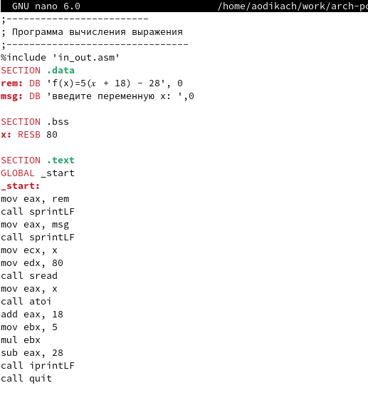{ #fig:012 width=70% }
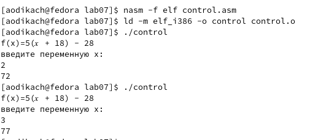{ #fig:013 width=70% }

# Выводы
Освоила арифметические инструкции языка ассемблера NASM.
