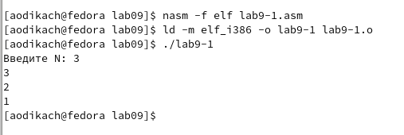
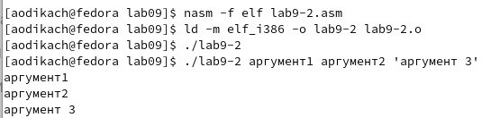

---
## Front matter
title: "Отчёта по лабораторной работе"
subtitle: "Лабораторная работа №9"
author: "Дикач Анна Олеговна"

## Generic otions
lang: ru-RU
toc-title: "Содержание"

## Bibliography
bibliography: bib/cite.bib
csl: pandoc/csl/gost-r-7-0-5-2008-numeric.csl

## Pdf output format
toc: true # Table of contents
toc-depth: 2
lof: true # List of figures
lot: true # List of tables
fontsize: 12pt
linestretch: 1.5
papersize: a4
documentclass: scrreprt
## I18n polyglossia
polyglossia-lang:
  name: russian
  options:
	- spelling=modern
	- babelshorthands=true
polyglossia-otherlangs:
  name: english
## I18n babel
babel-lang: russian
babel-otherlangs: english
## Fonts
mainfont: PT Serif
romanfont: PT Serif
sansfont: PT Sans
monofont: PT Mono
mainfontoptions: Ligatures=TeX
romanfontoptions: Ligatures=TeX
sansfontoptions: Ligatures=TeX,Scale=MatchLowercase
monofontoptions: Scale=MatchLowercase,Scale=0.9
## Biblatex
biblatex: true
biblio-style: "gost-numeric"
biblatexoptions:
  - parentracker=true
  - backend=biber
  - hyperref=auto
  - language=auto
  - autolang=other*
  - citestyle=gost-numeric
## Pandoc-crossref LaTeX customization
figureTitle: "Рис."
tableTitle: "Таблица"
listingTitle: "Листинг"
lofTitle: "Список иллюстраций"
lotTitle: "Список таблиц"
lolTitle: "Листинги"
## Misc options
indent: true
header-includes:
  - \usepackage{indentfirst}
  - \usepackage{float} # keep figures where there are in the text
  - \floatplacement{figure}{H} # keep figures where there are in the text
---

# Цель работы

Приобретение навыков написания программ с использованием циклов и
обработкой аргументов командной строки.

# Выполнение лабораторной работы
##  Реализация циклов в NASM

1. создаю каталог для программ лабораторной работы, перехожу в него и создаю файл (рис. [-@fig:001])

{ #fig:001 width=70% }

2. ввожу текст программы, создаю исполнемый файл, проверяю его работу (рис. [-@fig:002])

{ #fig:002 width=70% }

3. изменяю текст программы (изменение значение регистра ecx в цикле), создаю файл, запускаю его (рис. [-@fig:003]). теперь программа работает некорректно и число проходов цикла не соответствует значению, введенному с клавиатуры

{ #fig:003 width=70% }

4. изменяю текст программы, запускаю файл. теперь число проходов цикла соответствует значению N, введённому с клавиатуры (рис. [-@fig:004])

{ #fig:004 width=70% }

## Обработка аргументов командной строки

5. создаю файл lab9-2.asm в каталоге и ввожу в него текст программы из листинга. программа поочерёдно обработала все аргументы (рис. [-@fig:005])

{ #fig:005 width=70% }

6. создаю файл lab9-3.asm  в каталоге, ввожу в него текст листинга, создаю исполняемый файл и запускаю его. программа вывела сумму всех введённых аргументов (рис. [-@fig:006])

{ #fig:006 width=70% }

7. изменяю текст программы для вычисления произведения аргументов командной строки (рис. [-@fig:007])

{ #fig:007 width=70% }

# Задание для самостоятельной работы

1. программа для вычисления суммы значений функций (рис. [-@fig:008]) (рис. [-@fig:009])

{ #fig:008 width=70% }
{ #fig:009 width=70% }

# Выводы

приобрела навыки написания программ с использованием циклов и оработкой аргуметов командной строки
