---
## Front matter
title: "Отчёт по лабораторной работе"
subtitle: "Лабораторная №10"
author: "Дикач Анна Олеговна"

## Generic otions
lang: ru-RU
toc-title: "Содержание"

## Bibliography
bibliography: bib/cite.bib
csl: pandoc/csl/gost-r-7-0-5-2008-numeric.csl

## Pdf output format
toc: true # Table of contents
toc-depth: 2
lof: true # List of figures
lot: true # List of tables
fontsize: 12pt
linestretch: 1.5
papersize: a4
documentclass: scrreprt
## I18n polyglossia
polyglossia-lang:
  name: russian
  options:
	- spelling=modern
	- babelshorthands=true
polyglossia-otherlangs:
  name: english
## I18n babel
babel-lang: russian
babel-otherlangs: english
## Fonts
mainfont: PT Serif
romanfont: PT Serif
sansfont: PT Sans
monofont: PT Mono
mainfontoptions: Ligatures=TeX
romanfontoptions: Ligatures=TeX
sansfontoptions: Ligatures=TeX,Scale=MatchLowercase
monofontoptions: Scale=MatchLowercase,Scale=0.9
## Biblatex
biblatex: true
biblio-style: "gost-numeric"
biblatexoptions:
  - parentracker=true
  - backend=biber
  - hyperref=auto
  - language=auto
  - autolang=other*
  - citestyle=gost-numeric
## Pandoc-crossref LaTeX customization
figureTitle: "Рис."
tableTitle: "Таблица"
listingTitle: "Листинг"
lofTitle: "Список иллюстраций"
lotTitle: "Список таблиц"
lolTitle: "Листинги"
## Misc options
indent: true
header-includes:
  - \usepackage{indentfirst}
  - \usepackage{float} # keep figures where there are in the text
  - \floatplacement{figure}{H} # keep figures where there are in the text
---

# Цель работы

Приобретение навыков написания программ с использованием подпрограмм.
Знакомство с методами отладки при помощи GDB и его основными возможно-
стями

# Выполнение лабораторной работы
## Реализация подпрограмм в NASM

1. создаю каталог для выполнения лабораторной работы №10, перехожу в него и создаю файл lab10-1.asm

2. 1) внимательно изучаю текст программы, создаю исполняемый файл и проверяю его работу. так как файл не работал, вношу некоторые правки. (рис. [-@fig:001])

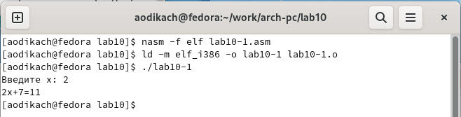{ #fig:001 width=70% }

2) меняю текст программы, добавив подпрограмму _subcalcul в подпрограмму _calcul, для вычисления выражения 𝑓(𝑔(𝑥)), где 𝑥 вводится с клавиатуры, 𝑓(𝑥) = 2𝑥 + 7, 𝑔(𝑥) = 3𝑥 − 1 (рис. [-@fig:002])

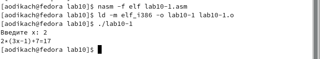{ #fig:002 width=70% }

## Отладка программ с помощью GDB

3. создаю файл lab10-2.asm с текстом программы из листинга 10.2, получаю исполняемый файл, добавляю отладочную информацию (рис. [-@fig:003])

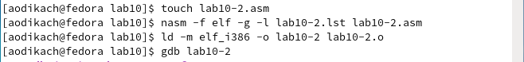{ #fig:003 width=70% }

4. проверяю работу программы запустив её в оболочке GDB с помощью команды run (рис. [-@fig:004])

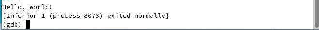{ #fig:004 width=70% }

5. для более подробного анализа программы устанавливаю брейкпоинт на метку _start, запускаю её (рис. [-@fig:005])

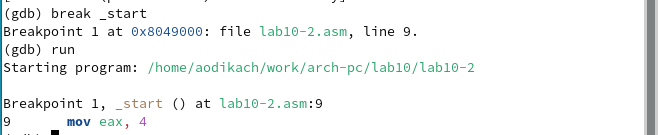{ #fig:005 width=70% }

6. просматриваю дисассимилированный код программы с помощью команды disassemble (рис. [-@fig:006])

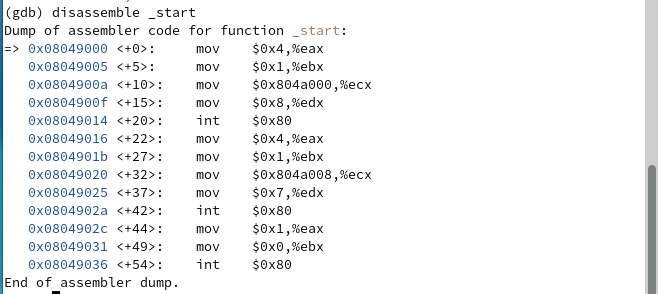{ #fig:006 width=70% }

7. переключаюсь на отображение команд с Intel’овским синтаксисом, введя команду set disassembly-flavor intel (рис. [-@fig:007]). после смены интерфейса команды отображаются с привычным intel'ловским синтаксисом
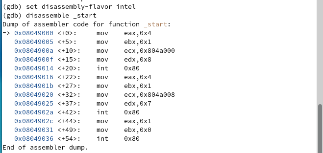{ #fig:007 width=70% }

## Добавление точек останова

8. проверяю была ли установлена точка останова с помощью команды info breakpoints (рис. [-@fig:008])

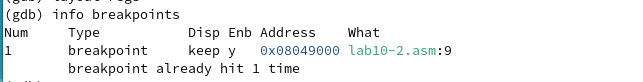{ #fig:008 width=70% }

9. устанавливаю ещё одну точку останова по адресу инструкции с помощью команды break *<адрес>

10. просматриваю информацию о всех установленных точках останова (рис. [-@fig:009])

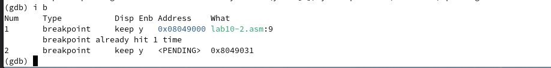{ #fig:009 width=70% }

## Работа с данными программы в GDB

11. выполняю 5 инструкций с помощью команды stepi ,,,

12. просматриваю значение переменной msg1 по имени (рис. [-@fig:010])

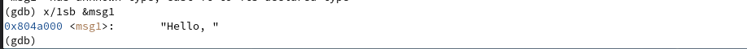{ #fig:010 width=70% }

13. просматриваю значение переменной msg2 по адресу (рис. [-@fig:011])

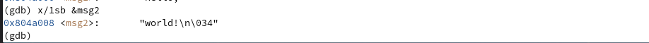{ #fig:011 width=70% }

14. просматриваю инструкцию mov ecx,msg2 которая записывает в регистр ecx адрес перемененной msg2 

15. изменяю первый символ переменной msg1 (рис. [-@fig:012])

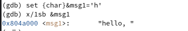{ #fig:012 width=70% }

16. заменяю символ во второй переменной msg2 с помощью команды set {char}0x804a009='0' (рис. [-@fig:013])

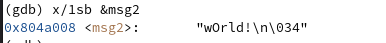{ #fig:013 width=70% }

17. вывожу в различных форматах значение регистра edx (рис. [-@fig:014]). 

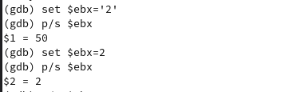{ #fig:014 width=70% }

18. завершаю выполнение программы с помощью команды continue и выхожу из GDB с помощью команды
quit (рис. [-@fig:015]). 

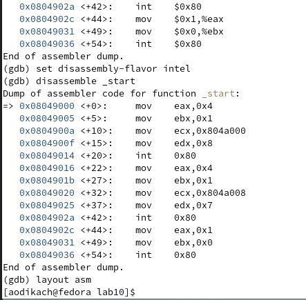{ #fig:015 width=70% }

## Обработка аргументов командной строки в GDB

19. копирую файл lab9-2.asm, создаю исполняемый файл, загружаю файл в отладчик, указав аргументы (рис. [-@fig:016]). 

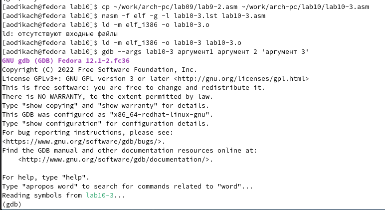{ #fig:016 width=70% }

20. устанавливаю точку останова перед первой инструкцией и запуска её (рис. [-@fig:017]). 

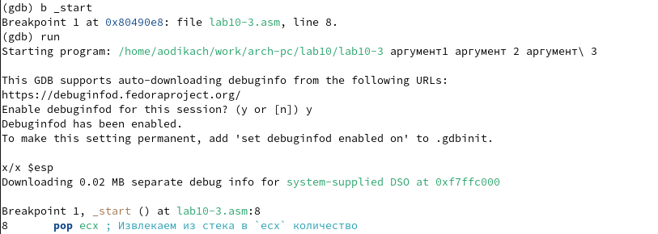{ #fig:017 width=70% }

21. смотрю позиции стека по их адресам. шаг изменения равен 4 т.к размер переменной 4 байта (рис. [-@fig:018]). 

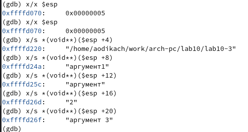{ #fig:018 width=70% }

## Задание для самостоятельной работы

1. преобразование программы из лабораторной №9 с реализацией вычисления функции как подпрограммы (рис. [-@fig:019])(рис. [-@fig:020]) (работаю в файле samr-1)

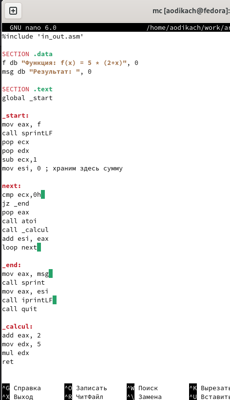{ #fig:019 width=70% }
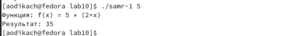{ #fig:020 width=70% }

2. создаю файл samr-2, ввожу текст программы листинга, открываю откладчик, отлаживаю код (рис. [-@fig:021]). в коде регистр edi копирует данные из еbx, а то время как копировать должен из eax, 5 должно прибавляться к eax, а также регистры ebx и eax перепутаны местами. (рис. [-@fig:022])(рис. [-@fig:023])

{ #fig:021 width=70% }
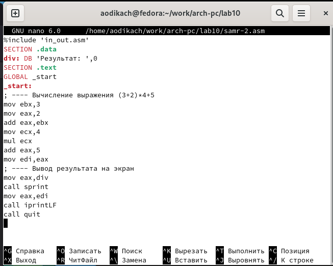{ #fig:022 width=70% }
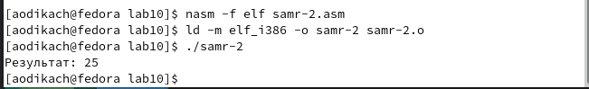{ #fig:023 width=70% }

# Вывод

научилась писать программы с использованием подпрограмм, а также попробовала переписать старую программу с использованием новой подпрограммы. узнала как пользоваться отладчиком и что такое отладка

