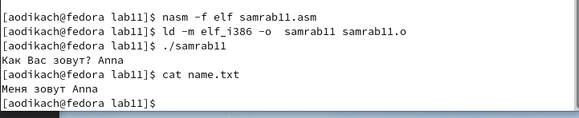

---
## Front matter
title: "Отчёт по лабораторной работе"
subtitle: "Лабораторная работа №11"
author: "Дикач Анна Олеговна"

## Generic otions
lang: ru-RU
toc-title: "Содержание"

## Bibliography
bibliography: bib/cite.bib
csl: pandoc/csl/gost-r-7-0-5-2008-numeric.csl

## Pdf output format
toc: true # Table of contents
toc-depth: 2
lof: true # List of figures
lot: true # List of tables
fontsize: 12pt
linestretch: 1.5
papersize: a4
documentclass: scrreprt
## I18n polyglossia
polyglossia-lang:
  name: russian
  options:
	- spelling=modern
	- babelshorthands=true
polyglossia-otherlangs:
  name: english
## I18n babel
babel-lang: russian
babel-otherlangs: english
## Fonts
mainfont: PT Serif
romanfont: PT Serif
sansfont: PT Sans
monofont: PT Mono
mainfontoptions: Ligatures=TeX
romanfontoptions: Ligatures=TeX
sansfontoptions: Ligatures=TeX,Scale=MatchLowercase
monofontoptions: Scale=MatchLowercase,Scale=0.9
## Biblatex
biblatex: true
biblio-style: "gost-numeric"
biblatexoptions:
  - parentracker=true
  - backend=biber
  - hyperref=auto
  - language=auto
  - autolang=other*
  - citestyle=gost-numeric
## Pandoc-crossref LaTeX customization
figureTitle: "Рис."
tableTitle: "Таблица"
listingTitle: "Листинг"
lofTitle: "Список иллюстраций"
lotTitle: "Список таблиц"
lolTitle: "Листинги"
## Misc options
indent: true
header-includes:
  - \usepackage{indentfirst}
  - \usepackage{float} # keep figures where there are in the text
  - \floatplacement{figure}{H} # keep figures where there are in the text
---

# Цель работы

Приобретение навыков написания программ для работы с файлами 

# Выполнение лабораторной работы

1. создаю каталог для программ лабораторной работы №11, перехожу в него и создаю файл lab11-1.asm и readme.txt (рис. [-@fig:001])

{ #fig:001 width=70% }

2. ввожу в файл lab11-1.asm текст программы из листинга 11.1 (программа записи сообщения). создаю исполняемый файл и проверяю его работу (рис. [-@fig:002]) (рис. [-@fig:003])

{ #fig:002 width=70% }

{ #fig:003 width=70% }

3. с помощью команды chmod изменяю права доступа к исполняемому файлу lab11-1, запретив его выполнение.после изменения прав доступа выполнение исполняемого файла перестало быть возможным (рис. [-@fig:004])

{ #fig:004 width=70% }

4. с помощью команды chmod изменяю права доступа к файлу lab11-1.asm с исходным текстом программы, добавив права на исполнение (рис. [-@fig:005]) благодаря новым изменениям выполнение файла стало возможным 

{ #fig:005 width=70% }

5. предоставляю права доступа к файлу readme.txt в соответствии с вариантом в таблице 11.4. проверяю правильность выполнения с помощью команды ls -l. 
вариант №10: для предоставления прав доступа следует предоставить запись в двоичной системе, а затем в восьмеричной и поменять права доступа:

1)r-- r-- rwx => 100 100 111 =>447 (рис. [-@fig:006])

2) 001 100 010 => --x r-- -w- => 142 (рис. [-@fig:007])

{ #fig:006 width=70% }

{ #fig:007 width=70% }

## Задания для самостоятельной работы

1. пишу программу работающую по следующему алгоритму:
- вывод приглашения "как вас зовут?"
- ввести с клавиатуры свои фамилию и имя
- создать файл с именем name.txt
- записать в файл сообщение "меня зовут"
- дописать в файл строку введённую с клавиатуры 
- закрыть файл 

создаю исполняемый файл samrab.asm и проверяю его работу. проверяю наличие файла и его содержимое с помощью команд ls и cat. (рис. [-@fig:008]) (рис. [-@fig:009]) (рис. [-@fig:010])

{ #fig:008 width=70% }

{ #fig:009 width=70% }

{ #fig:010 width=70% }

# Выводы

научилась работать с файлами средствами NASM, предоставлять права доступа к файлам, редактировать и удалять файлы.

